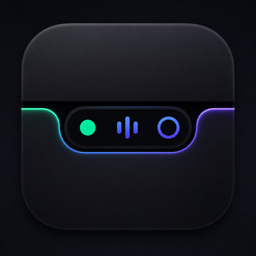

<h1 align="center">
  
  <br>
  Brow
</h1>

Brow is a personal macOS notch-overlay app built on top of
[**boring.notch**](https://github.com/TheBoredTeam/boring.notch) by The
Boring Team. The fork starts from feature parity with upstream and
grows from there.

> Brow is licensed under the **GNU General Public License v3.0** — the
> same license as upstream. Every commit in this repository inherits
> GPL v3.

## Status

Early. The upstream import has just landed; bundle identifiers,
signing, app icon, menu/Settings copy and CI have been rebranded.
The first downloadable build ships unsigned by an Apple Developer ID,
so the install flow requires one extra step (below).

## Highlights beyond upstream

- **Claude Code integration** — Brow listens for the Claude Code
  hooks on `127.0.0.1:21064` and surfaces them in the notch:
  - The notch auto-expands into a dedicated AI tab when a
    permission request arrives, with a prominent
    Allow / Suggestion / Deny row sized for the notch.
  - `AskUserQuestion` is auto-allowed and surfaces a toast pointing
    the user to the terminal — Claude's native multi-choice picker
    stays in charge.
  - A rainbow halo wraps the notch outline (3 corners + bottom edge)
    while there's something waiting, fading out once the queue is
    empty.
  - Keyboard shortcuts for Allow / Allow-always / Deny live in
    **Settings → Shortcuts** and act on the head of the queue.
  
- **Per-screen display selection** — pick any subset of connected
  displays to render the notch on, with a "Select all / none" menu.
  The selection is keyed by display UUID and persists across
  disconnects so plugging the screen back in restores the previous
  choice.
  
- **Custom Lottie animations** — drop in `.json` files (uploaded from
  disk *or* pasted as a URL) and use them as either the music
  visualizer or the AI mascot. Per-visualizer Speed + Scale sliders
  go down to 1% so even 1080×1080 viewport animations fit cleanly.
  

## Install

1. Download the latest `Brow-x.y.z.dmg` from
   [Releases](https://github.com/tuanle03/Brow/releases).
2. Open the DMG and drag **Brow.app** into `/Applications`.
3. Brow is **ad-hoc signed** (no paid Apple Developer ID yet), so
   macOS Gatekeeper will refuse to launch it on first run. Strip the
   download-quarantine flag with one command:

   ```bash
   xattr -dr com.apple.quarantine /Applications/Brow.app
   ```

4. Launch Brow from Applications. You'll be prompted for the
   permissions Brow needs (calendar, accessibility, camera, etc.) —
   grant whichever features you want to use.

> Alternative: instead of step 3, you can right-click Brow.app in
> Finder → **Open** → **Open** in the prompt. That also bypasses
> Gatekeeper but only works for some users on recent macOS versions;
> the `xattr` command is the reliable fallback.

## Requirements

- macOS **14 Sonoma** or later
- Apple Silicon or Intel Mac
- Xcode **16** or later (only needed to build from source)

## Build from source

```bash
git clone git@github.com:tuanle03/Brow.git
cd Brow
open Brow.xcodeproj
```

In Xcode, select the **Brow** scheme and Run (`⌘R`). The first build
resolves Swift Package dependencies, which can take a moment.

Signing is configured for development team `3AGYM77Y39`; if you build
the fork yourself, set your own team in the project's *Signing &
Capabilities* tab.

## Project layout

```
Brow/                  application target (Swift / SwiftUI)
BrowXPCHelper/         XPC helper for accessibility + brightness APIs
mediaremote-adapter/   bundled MediaRemoteAdapter for macOS 15.4+
Configuration/         signing, DMG, Sparkle config
.github/workflows/     CI (Build for macOS on push / PR)
```

## Attribution

Upstream copyright (c) The Boring Team contributors. See
[`NOTICE.md`](./NOTICE.md) for the GPL v3 modification notice and
[`UPSTREAM_README.md`](./UPSTREAM_README.md) for the original upstream
README, preserved verbatim.

Third-party library credits live in
[`THIRD_PARTY_LICENSES`](./THIRD_PARTY_LICENSES).
